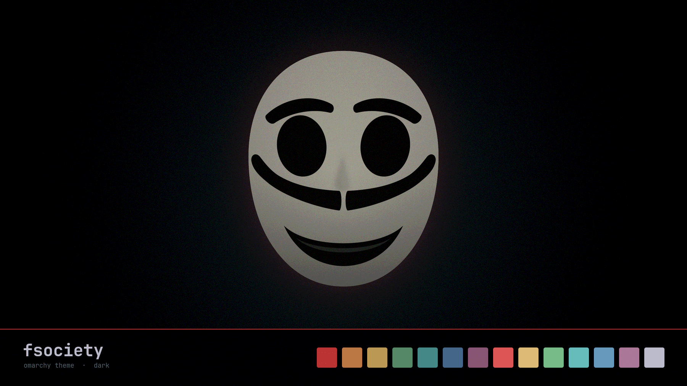

# fsociety

An [Omarchy](https://omarchy.org) theme. Cold blue-black grade, desaturated
support colors, one signature red spent only where it means something.



## Install

```bash
omarchy theme install https://github.com/prjoni99/omarchy-fsociety-theme.git
```

That clones the theme to `~/.config/omarchy/themes/fsociety` and applies it.
After that it's in the theme picker like any other — `omarchy theme set fsociety`,
or pick it from the menu.

## What's in it

| | |
|---|---|
| `colors.toml` | Palette. Omarchy regenerates the terminal, Neovim, and VS Code themes from this. |
| `shell.*.toml` | Ten files theming the Omarchy shell — bar, launcher, menu, lock screen, notifications, polkit, popups, tooltips, controls, image picker. |
| `backgrounds/` | Five 2560x1440 wallpapers. |
| `icons.theme` | Yaru-red-dark. |
| `unlock.png` | Lock screen graphic. |

## Palette

| Role | Hex | | Role | Hex |
|---|---|---|---|---|
| accent | `#d8463f` | | red | `#c7423c` |
| background | `#0c0f11` | | orange | `#c97c4a` |
| dark background | `#080a0c` | | yellow | `#c9a15a` |
| darker background | `#050607` | | green | `#5a8f6e` |
| lighter background | `#161a1d` | | cyan | `#4c8c93` |
| foreground | `#c3cbce` | | blue | `#4a6e8c` |
| dark foreground | `#5c686c` | | magenta | `#8c6076` |
| bright foreground | `#e2e9eb` | | brown | `#6e4a3c` |

The design rule, if you want to extend it: the red is a signal, not decoration.
It marks keyboard focus, the active border, selection, and errors — nothing else.
Idle and hover states stay neutral so the red keeps its meaning.

## Backgrounds

The five wallpapers are AI-generated for this theme and are covered by the
license below. Swap in your own by dropping files into
`~/.config/omarchy/backgrounds/fsociety/` — Omarchy picks them up alongside
the bundled ones, no need to edit the theme.

## Notes

This is a fan theme inspired by the look of *Mr. Robot*. It is not affiliated
with, endorsed by, or connected to USA Network, NBCUniversal, or the show's
creators. No show assets are redistributed here.

## License

MIT — see [LICENSE](LICENSE).
